# Projeto - App de receitas

<a href="https://higormn.github.io/app-recipes/" target="_blank">Visite o App de receitas</a> 

  
<strong>👨‍💻 O que foi desenvolvido</strong>
 

Desenvolver um app de receitas, utilizando o que há de mais moderno dentro do ecossistema React: Hooks e Context API!

Nele será possível: ver, buscar, filtrar, favoritar e acompanhar o progresso de preparação de receitas de comidas e bebidas!

A base de dados é 2 APIs distintas, uma para comidas e outra para bebidas.

O layout tem como foco dispositivos móveis, dessa forma todos os protótipos vão estar desenvolvidos em telas menores.

  
<strong>🚀 Habilidades</strong>
 

- Utilizar _Redux_ para gerenciar estado
- Utilizar a biblioteca _React-Redux_
- Utilizar a Context API do _React_ para gerenciar estado
- Utilizar o _React Hook useState_
- Utilizar o _React Hook useContext_
- Utilizar o _React Hook useEffect_
- Criar Hooks customizados

 

# Telas

  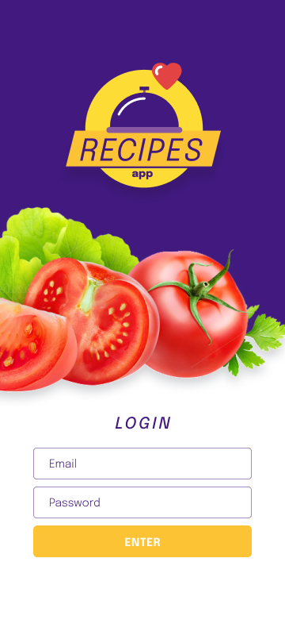
  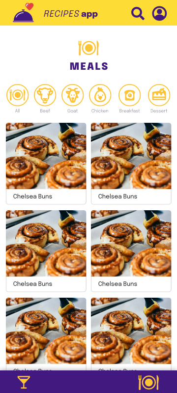
  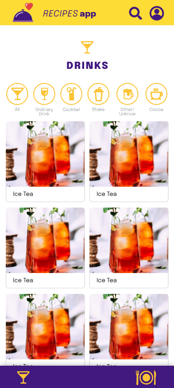

 

  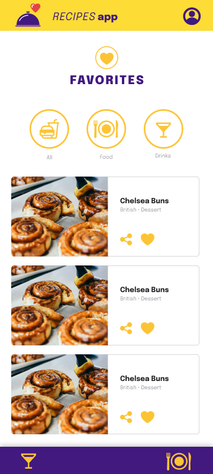
  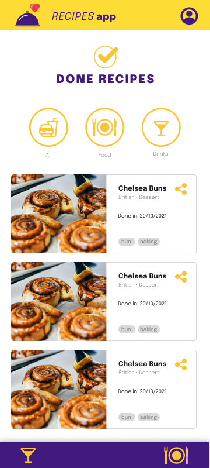
  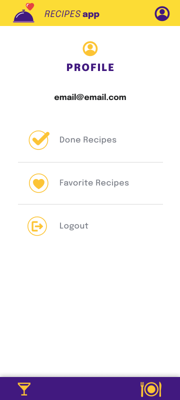

 

  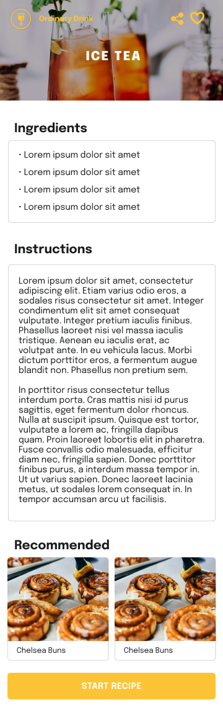
  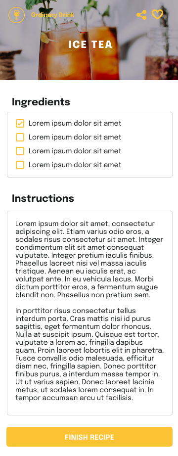
  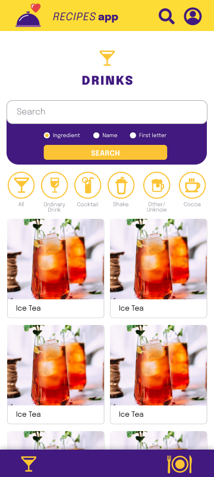

 

  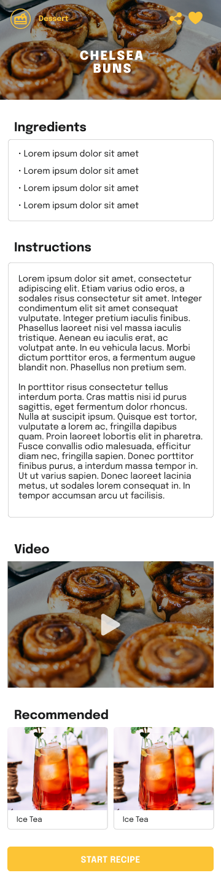
  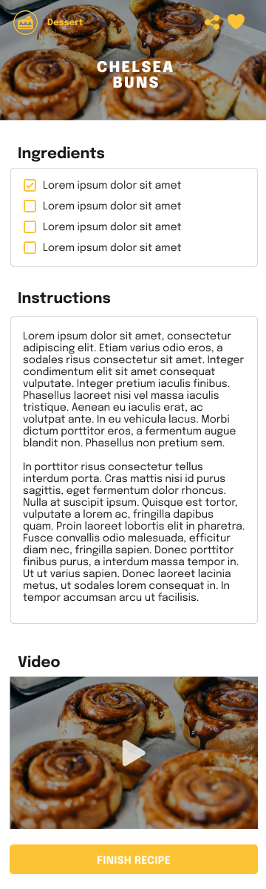
  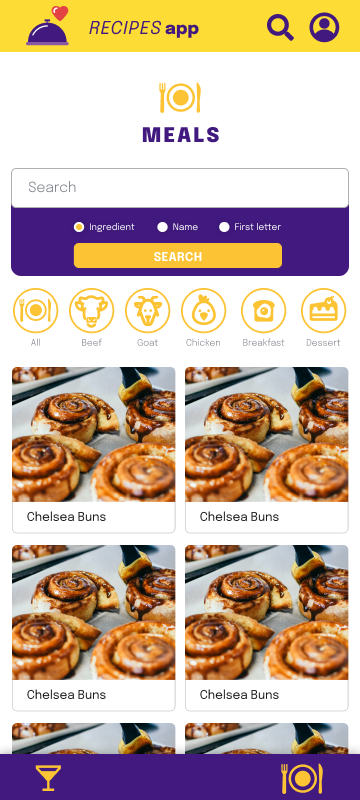

 
